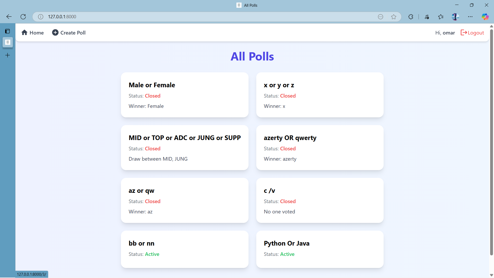

# Django Simple Polls App

A modern polls application built with **Django** and styled with **Tailwind CSS**. Users can create polls, vote, and see real-time results. Poll creators can close or delete polls. The app provides a clean, responsive, and user-friendly interface.

---

## Features

- Create polls with multiple-choice options (2–10 choices).  
- Users can vote and see poll results.  
- Poll creators can close or delete polls.  
- Voting restrictions prevent multiple votes per user.  
- Dynamic UX for creating polls with a variable number of choices.  
- User registration and login with friendly form design.  
- Fully responsive design using **Tailwind CSS**.  

---

## Installation

1. **Clone the repository**

```bash
git clone https://github.com/OmAr1dev/django-simple-polls-app.git
cd django-simple-polls-app
```

2. **Create a virtual environment and activate it**

```bash
python -m venv .venv
source .venv/bin/activate    # Linux / macOS
.venv\Scripts\activate     # Windows
```

3. **Install dependencies**

```bash
pip install -r requirements.txt
```

4. **Apply migrations**

```bash
python manage.py migrate
```

5. **Create a superuser (optional)**

```bash
python manage.py createsuperuser
```

6. **Run the development server**

```bash
python manage.py runserver
```

7. Open your browser at `http://127.0.0.1:8000/`

---

## Usage

- Register a new account or login with an existing account.  
- Create a new poll by selecting the number of choices and entering choice options.  
- Vote on active polls and view real-time results.  
- Poll creators can close a poll to prevent further votes or delete it entirely.  
- Closed polls display the winner, a draw, or "No one voted" if no votes were cast.  

---

## Screenshots





---

## License

This project is licensed under the **MIT License**. See [LICENSE](LICENSE) for details.

---

## Author

**Omar Soudani** – [GitHub](https://github.com/OmAr1dev)

---

## Technologies Used

- **Python 3.x**  
- **Django 4.x**  
- **Tailwind CSS**  
- HTML5 / CSS3 / JavaScript
